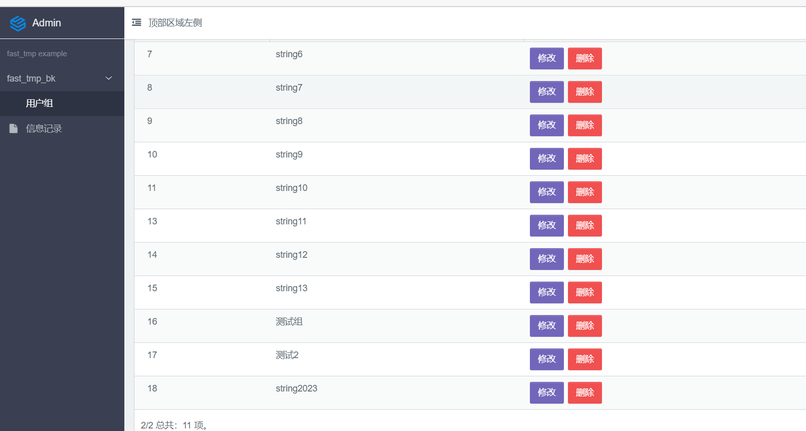

# fast-tmp

## 概述

本项目基于fastapi+tortoise-orm+amis构建，主要功能为构建通用服务端渲染页面的包。
只需要导入相关的模块，并使用AmisRouter替换APIRouter，在写路由的时候增加view_schema即可实现自定义页面的生成。
整体功能和django-admin类似，但是更加强大。得益于百度的AMIS项目，能够通过json生成页面，才有本项目的效果。

项目正在积极开发中，该项目主要是为之后的fastapi开发做准备。 note:项目正在清理tortoise-orm中。

已完成一个可以用来调试amis的版本，真不容易。
另：使用的tortoise-orm不是官方的版本，需要通过代码仓库进行加载：
```toml
[tool.poetry.dependencies]
tortoise-orm = { git = "https://github.com/Chise1/tortoise-orm.git" , branch = "master"}

```

### 多对多字段的处理

多对多字段处理目前非常的不友好，使用流程如下：

1. 需要对多对多字段定义响应的字段名-selects请求接口，返回用户可选的字段
2. get的时候暂时没有合适的控件显示多对多字段，用户需要手动把字段拼接为字符串返回（当然我建议不要在list显示）
3. 创建的时候，pydantic_model_creator无法增加多对多字段，所以得自己继承然后增加```List[int]```字段，
4. 修改的时候，也需要注意上述字段。参考Group的增删改查。


另外吐个槽：tortoise-orm的多对多字段实现有问题，想要增加多对多关系，如果只有id，至少要请求3次数据库。
   （一个是方法不支持直接使用id，第二个是外键居然没有使用联合索引，导致需要先提前获取是否有相关值）
# example启动方法

1. 把.env_example改为.env
2. 使用alembic初始化数据库（注意，执行之前需要添加环境变量：FASTAPI_SETTINGS_MODULE=example.settings）
3. 启动main.py

## 已完成功能

1. 完整的权限管理和基于权限的动态生成路由（由于amis的bug，需要修复）
2. 路由和视图结合，基于amis，可根据amis的schema堆叠页面功能，生成对应的业务页面。（目前不考虑美观问题，等项目主要功能完成之后再考虑美观问题）
3. 基于fastapi重新开发了AmisRouter和AmisApi。

## 路由设计逻辑

AmisApi：定义一个app，一般为一个项目的根节点，再通过mount加载fast_tmp等其他子项目 AmisRouter:定义一个页面app，每一个router都是一个路由节点或者页面。
Widget:每一个页面上的控件（大多数时候为对应接口提供） site接口根据路由树生成对应的路由，前端可根据路由加载导航和页面的视图。

## 目标

1. 集成admin管理页面
2. 集成amis主要功能
3. 构建项目脚本工具

## 使用说明

1. 配置环境变量 SETTINGS_MODULE=src.settings
2. 在tortoise-orm的models列表里面增加fast_tmp.models 示例(
   请参考项目：fastapi-t，目前主要是用fastapi-t编写和测试，成熟之后再迁移到fast_tmp)

```python
from typing import Optional

from fastapi import Depends
from tortoise.transactions import in_transaction

from fast_tmp.amis.tpl import CRUD_TPL
from fast_tmp.amis_router import AmisRouter
from fast_tmp.api.schemas import group_list_schema, GroupS
from fast_tmp.models import User, Group, Permission
from fast_tmp.amis.utils import get_columns_from_model, get_controls_from_model
from fast_tmp.depends import get_user_has_perms

group_router = AmisRouter(title="用户组")

tpl = CRUD_TPL('用户组', "get:/group", columns=get_columns_from_model(Group))
tpl.add_create_button("post:/group", get_controls_from_model(Group, exclude=("id",)))
tpl.add_modify_button(
    get_api="get:/group/?id=${id}", put_api="put:/group/${id}",
    controls=get_controls_from_model(Group, exclude=("id",)))
tpl.add_delete_button("delete:/group/${id}")
group_router.registe_tpl(tpl)


@group_router.get("/group", )
async def get_group(id: Optional[int] = None,
                    user: User = Depends(get_user_has_perms(['group_can_read'])), ):
    if id:
        x: Group = await Group.get(id=id).prefetch_related("permissions", "users")
        return GroupS(label=x.label, permissions=[i.id for i in x.permissions],
                      users=[i.id for i in x.users])

    return {
        "total": await Group.all().count(),
        "items": await group_list_schema.from_queryset(Group.all().order_by("id", )),
    }


@group_router.post("/group")
async def post_group(group: GroupS,  # fixme:无法直接获取多对多字段
                     user: User = Depends(get_user_has_perms(['group_can_read'])), ):
    cr_g = await Group.create(label=group.label)
    permissions = await Permission.filter(id__in=group.permissions)
    users = await User.filter(id__in=group.users)
    # fixme:tortoise-orm的多对多字段很难用，需要访问多次数据库，以后考虑更换为sqlalchemy
    await cr_g.permissions.add(*permissions)
    await cr_g.users.add(*users)


@group_router.put("/group/${id}")
async def put_group(group: GroupS, id: int,
                    user: User = Depends(get_user_has_perms(['group_can_read'])), ):
    g = await Group.get(id=id)
    async with in_transaction() as connection:
        await g.users.clear()
        await g.permissions.clear()
        if group.users:
            await g.users.add(*await User.filter(id__in=group.users))
        if group.permissions:
            await g.permissions.add(*await Permission.filter(id__in=group.permissions))
@group_router.delete("/group/${id}")
async def put_group(id: int,
                    user: User = Depends(get_user_has_perms(['group_can_read'])), ):
    g = await Group.get(id=id)
    await g.delete()


@group_router.get("/permissions-selects")
async def get_permission_select():
    x = await Permission.all()
    res = [{"label": permission.label, "value": permission.pk} for permission in x]
    return res


@group_router.get("/users-selects")
async def get_users_select():
    x = await User.all()
    res = [{"label": user.username, "value": user.pk} for user in x]
    return res

```

效果：



## 功能

### cache缓存

略

### auth模型

包括User,Permission,Group三项
